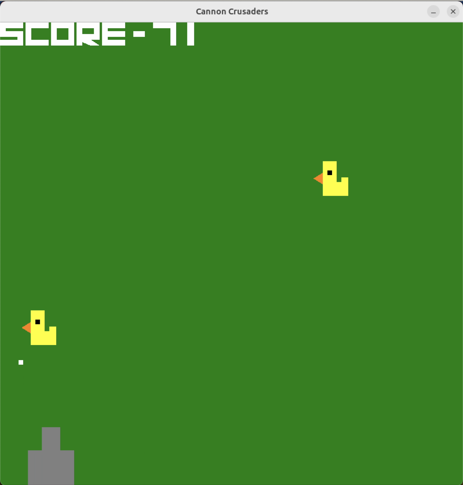
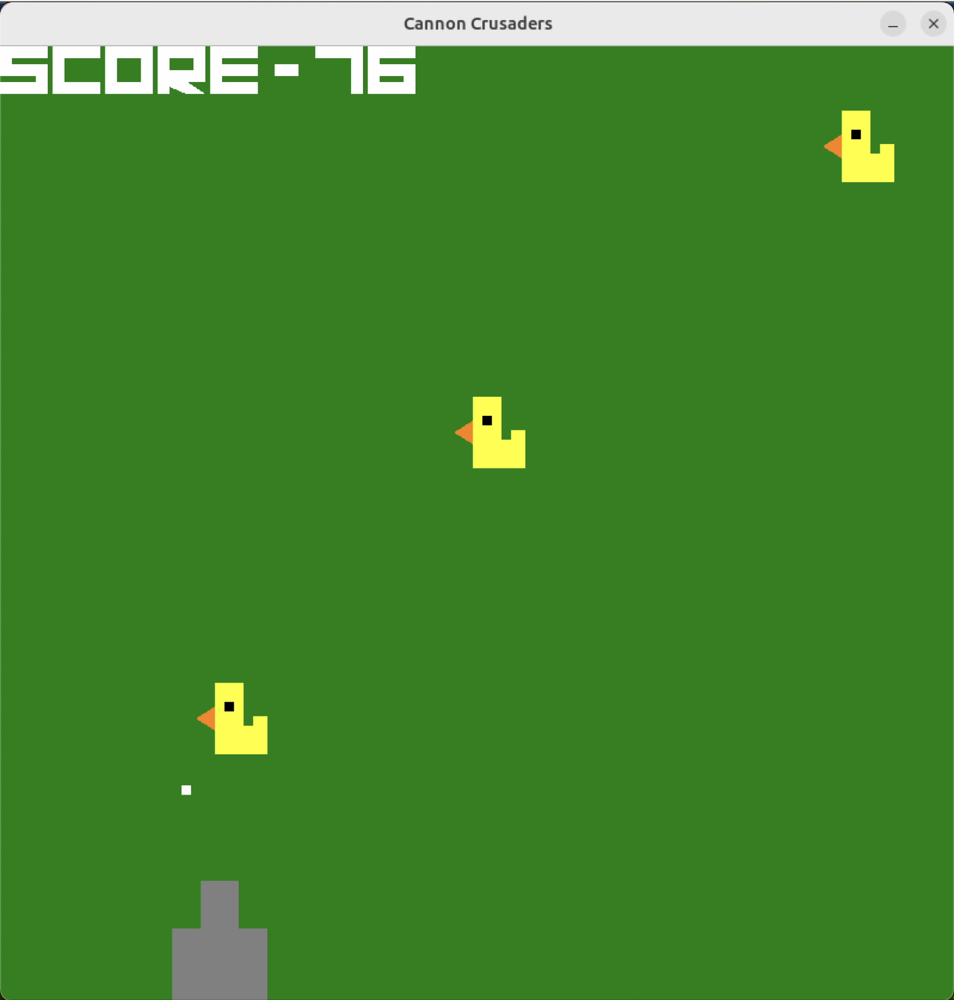
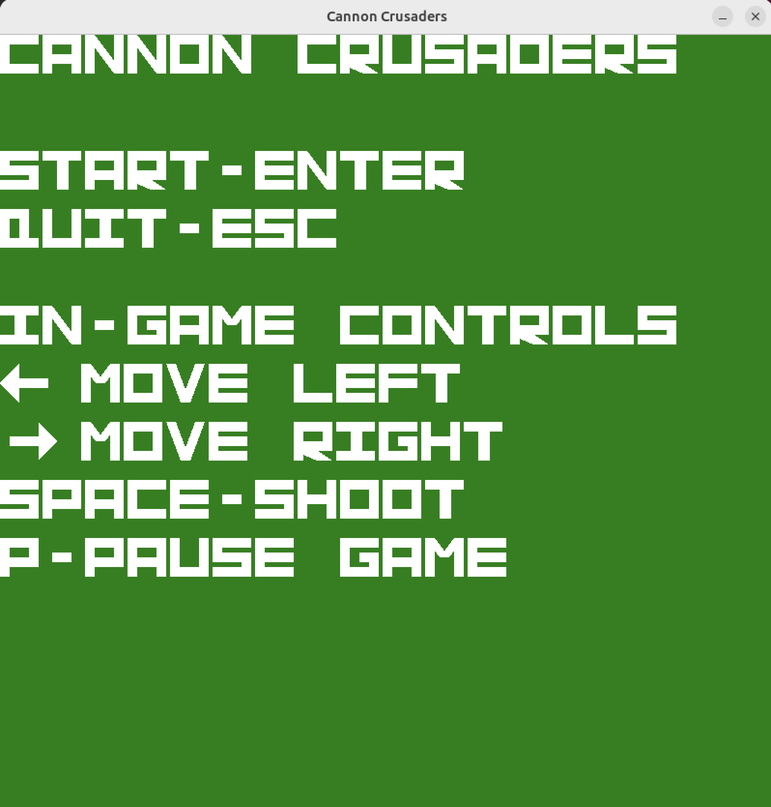
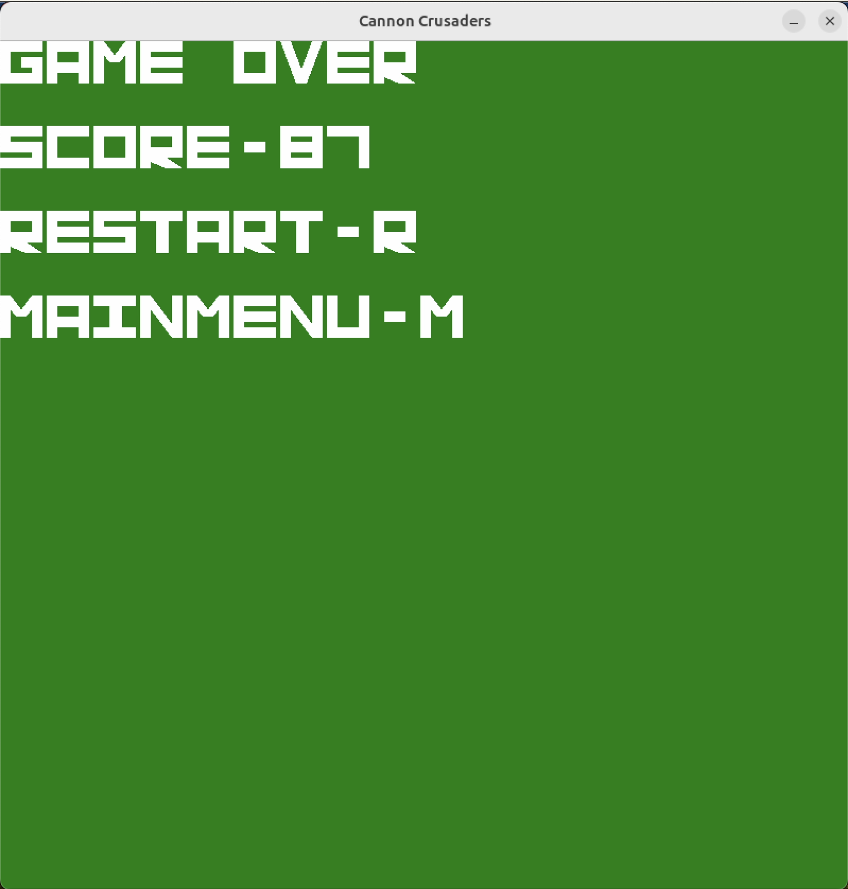

# Cannon Crusaders

Leap into "Cannon Crusaders," the ultimate 2D tank shooter where you blast through waves of speedy ducks with your trusty cannon. As your score soars, the challenge mounts with ducks coming faster, turning each shot into a thrilling test of precision and reflexes.

  
  

## How to Install

Notes: 
- $TOP_DIR refers to the highest directory level in this project, where CMakeLists.txt and IDENTIFICATION.txt are located.
- $INSTALL_DIR refers to the directory in which the game is to be installed.

To build and install Cannon Crusaders, the following commands should be executed after confirming OpenGL, GLFW, and GLEW packages are available:

    cd $TOP_DIR
    cmake -H. -Btmp_cmake -DCMAKE_INSTALL_PREFIX=$INSTALL_DIR
    cmake --build tmp_cmake --clean-first --target install

To run the game, execute the following command:

    $INSTALL_DIR/bin/demo

## How to Play

After running the demo executable file, you'll be greeted with an initial screen displaying commands to start playing. As you successfully shoot more ducks, your score in the upper left corner will increase. You can pause the game at any point by pressing 'P'; it can be resumed by pressing 'ENTER' or restarted with 'R'. If a duck makes contact with your tank or passes by it, you lose. Subsequently, you'll be presented with another screen, as shown below.

  
  

### Controls

Below is a table for the in-game controls:

| Key          | Action                        |
|--------------|-------------------------------|
| Enter        | Start game                    |
| Left Arrow   | Move Tank left                |
| Right Arrow  | Move Tank right               |
| Space Bar    | Shoot                         |
| P            | Pause game                    |
| Escape       | Exit Application              |
| R            | Restart game                  |

